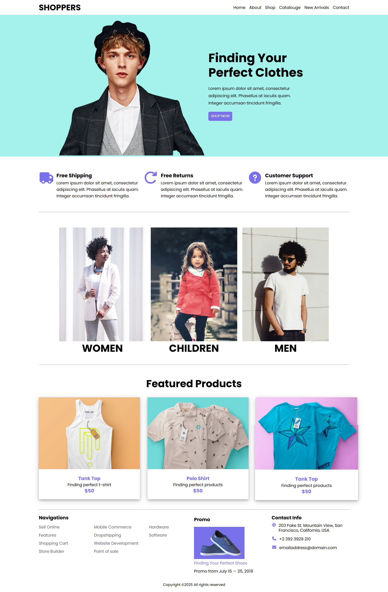

# Ex02 Commercial Website

## Date: 07-08-2025

## AIM

To create a commercial website using CSS Flexbox.

## ALGORITHM

### STEP 1

Create an HTML file (index.html)

### STEP 2

Create a CSS file (style.css)

### STEP 3

Include a navigation bar with links to different sections.

### STEP 4

Add structured sections for Homepage, Products / Services, About Us, Contact Details and User Account.

### STEP 5

Include social media links at the footer with copyright information.

### STEP 6

Define global styles for fonts, colors, and layout.

### STEP 7

Style the header, navigation bar, and sections.

### STEP 8

Use Flexbox for layout design.

### STEP 9

Add hover effects and transitions for interactivity.

### STEP 10

Add Images and Media.

### STEP 11

Use optimized images for a professional look.

### STEP 12

Open the HTML file in a browser to check layout and functionality.

### STEP 13

Fix styling issues and refine content placement.

### STEP 14

Deploy the website.

### STEP 15

Upload to GitHub Pages for free hosting.

## PROGRAM

### index.html

```html
<!DOCTYPE html>
<html lang="en">
  <head>
    <meta charset="UTF-8" />
    <meta name="viewport" content="width=device-width, initial-scale=1.0" />
    <title>SHOPPERS</title>
    <link rel="stylesheet" href="style.css" />
    <style>
      @import url("https://fonts.googleapis.com/css2?family=Poppins:wght@300;400;600;700&display=swap");
    </style>
    <link
      rel="stylesheet"
      href="https://cdnjs.cloudflare.com/ajax/libs/font-awesome/7.0.0/css/all.min.css"
      integrity="sha512-DxV+EoADOkOygM4IR9yXP8Sb2qwgidEmeqAEmDKIOfPRQZOWbXCzLC6vjbZyy0vPisbH2SyW27+ddLVCN+OMzQ=="
      crossorigin="anonymous"
      referrerpolicy="no-referrer"
    />
  </head>
  <body>
    <!-- Header Section -->
    <header class="header-section container">
      <h1 class="">SHOPPERS</h1>
      <nav class="navbar">
        <ul class="nav-items">
          <li><a href="#">Home</a></li>
          <li><a href="#">About</a></li>
          <li><a href="#">Shop</a></li>
          <li><a href="#">Catalouge</a></li>
          <li><a href="#">New Arrivals</a></li>
          <li><a href="#">Contact</a></li>
        </ul>
      </nav>
    </header>

    <!-- Hero Section -->
    <section class="hero-section">
      <div class="hero-container">
        <div class="hero-left">
          
        </div>
        <div class="hero-right">
          <h1 class="text-5xl">Finding Your Perfect Clothes</h1>
          <p>
            Lorem ipsum dolor sit amet, consectetur adipiscing elit. Phasellus
            at iaculis quam. Integer accumsan tincidunt fringilla.
          </p>
          <button>SHOP NOW</button>
        </div>
      </div>
    </section>

    <!-- Info Section -->
    <section class="info-section container">
      <div class="info-container">
        <div class="icon-container">
          <i class="fa fa-truck"></i>
        </div>
        <div class="info-content">
          <h4 class="text-xl">Free Shipping</h4>
          <p>
            Lorem ipsum dolor sit amet, consectetur adipiscing elit. Phasellus
            at iaculis quam. Integer accumsan tincidunt fringilla.
          </p>
        </div>
        <div class="icon-container">
          <i class="fa fa-arrow-rotate-right"></i>
        </div>
        <div class="info-content">
          <h4 class="text-xl">Free Returns</h4>
          <p>
            Lorem ipsum dolor sit amet, consectetur adipiscing elit. Phasellus
            at iaculis quam. Integer accumsan tincidunt fringilla.
          </p>
        </div>
        <div class="icon-container">
          <i class="fa fa-circle-question"></i>
        </div>
        <div class="info-content">
          <h4 class="text-xl">Customer Support</h4>
          <p>
            Lorem ipsum dolor sit amet, consectetur adipiscing elit. Phasellus
            at iaculis quam. Integer accumsan tincidunt fringilla.
          </p>
        </div>
      </div>
      <hr />
    </section>

    <!-- Collections Section -->
    <section class="collections container">
      <div class="collection-cards">
        <div class="card">
          
          <h2 class="text-4xl">WOMEN</h2>
        </div>
        <div class="card">
          
          <h2 class="text-4xl">CHILDREN</h2>
        </div>
        <div class="card">
          
          <h2 class="text-4xl">MEN</h2>
        </div>
      </div>
      <hr />
    </section>

    <!-- Featured Section -->
    <section class="featured-section container">
      <h1 class="text-4xl">Featured Products</h1>
      <div class="slides-container">
        <div class="slide">
          
          <div class="slides-content">
            <h3>Tank Top</h3>
            <p>Finding perfect t-shirt</p>
            <h3>$50</h3>
          </div>
        </div>
        <div class="slide">
          
          <div class="slides-content">
            <h3>Polo Shirt</h3>
            <p>Finding perfect products</p>
            <h3>$50</h3>
          </div>
        </div>
        <div class="slide">
          
          <div class="slides-content">
            <h3>Tank Top</h3>
            <p>Finding perfect products</p>
            <h3>$50</h3>
          </div>
        </div>
      </div>
      <hr />
    </section>

    <!-- Footer Section -->
    <footer class="footer-section container">
      <div class="navigations">
        <h3>Navigations</h3>
        <ul class="footer-nav-list">
          <li><a href="#">Sell Online</a></li>
          <li><a href="#">Features</a></li>
          <li><a href="#">Shopping Cart</a></li>
          <li><a href="#">Store Builder</a></li>

          <li><a href="#">Mobile Commerce</a></li>
          <li><a href="#">Dropshipping</a></li>
          <li><a href="#">Website Development</a></li>

          <li><a href="#">Point of sale</a></li>
          <li><a href="#">Hardware</a></li>
          <li><a href="#">Software</a></li>
        </ul>
      </div>
      <div class="promo">
        <h3>Promo</h3>
        
        <a href="#">Finding Your Perfect Shoes</a>
        <p>Promo from July 15 — 25, 2019</p>
      </div>
      <div class="contact-info">
        <h3>Contact Info</h3>
        <div class="contact-info-container">
          <i class="fa fa-location"></i>
          <p>203 Fake St. Mountain View, San Francisco, California, USA</p>
        </div>
        <div class="contact-info-container">
          <i class="fa fa-phone"></i>
          <p>+2 392 3929 210</p>
        </div>
        <div class="contact-info-container">
          <i class="fa fa-envelope"></i>
          <p>emailaddress@domain.com</p>
        </div>
      </div>
    </footer>
  </body>
</html>
```

### style.css

```css
* {
  margin: 0;
  padding: 0;
  box-sizing: border-box;
}

body {
  font-family: "poppins", sans-serif;
  line-height: 1.2;
}

/* Header Section */

.header-section {
  display: flex;
  justify-content: space-between;
  align-items: center;
}

.header-section h1 {
  cursor: pointer;
}

.header-section .navbar .nav-items {
  display: flex;
  gap: 15px;
}

.header-section .navbar .nav-items li {
  list-style-type: none;
}

.header-section .navbar .nav-items li a {
  text-decoration: none;
  color: black;
}

.header-section .navbar .nav-items li a:hover {
  color: #7971eb;
  transition: 0.3s ease;
}

/* Hero Section */

.hero-container {
  display: flex;
  flex-wrap: wrap;
  background-color: #a5f2ec;
}

.hero-container .hero-left img {
  height: 80vh;
}

.hero-container .hero-right {
  display: flex;
  width: 25vw;
  gap: 20px;
  flex-direction: column;
  justify-content: center;
  align-items: flex-start;
}

.hero-container .hero-right button {
  padding: 10px;
  background-color: #7971ea;
  border: none;
  color: white;
  cursor: pointer;
  transition: transform 0.3s ease-in-out;
  border-radius: 5px;
}

.hero-container .hero-right button:hover {
  transform: scale(1.1);
  box-shadow: 0 4px 8px rgba(0, 0, 0, 0.2);
}

.hero-container .hero-right p {
  line-height: 1.8;
}

/* Info Container */
.info-section {
  display: flex;
  flex-direction: column;
}

.info-section .info-container {
  display: flex;
  gap: 10px;
  line-height: 1.6;
  padding: 50px 0;
}

.info-container .icon-container i {
  font-size: 48px;
  color: #7971ea;
}

/* Collections Section */
.collection-cards {
  display: flex;
  justify-content: center;
  align-items: center;
  gap: 20px;
  padding: 40px 0;
  flex-wrap: wrap;
}

.collection-cards .card {
  text-align: center;
}

.collection-cards img {
  height: 450px;
  cursor: pointer;
  transition: 0.3s ease;
}

.collection-cards img:hover {
  transform: scale(1.02);
}

.collection-cards .card .card-text {
  position: absolute;
  bottom: 10px;
  color: white;
}

/* Featured Section */
.featured-section h1 {
  text-align: center;
  padding: 30px 0;
}

.slides-container {
  display: flex;
  gap: 30px;
  padding-bottom: 40px;
}

.slides-container img {
  width: 400px;
}

.slides-container .slide {
  box-shadow: 0 4px 8px 0 rgba(0, 0, 0, 0.2), 0 6px 20px 0 rgba(0, 0, 0, 0.19);
  cursor: pointer;
  transition: 0.3s ease;
}

.slides-container .slide:hover {
  transform: scale(1.02);
}

.slides-container .slide .slides-content {
  text-align: center;
  line-height: 1.4;
  padding: 20px 0;
}

.slides-container .slide .slides-content h3 {
  color: #7971ea;
}

/* Footer Section */
.footer-section {
  display: grid;
  grid-template-columns: 2fr 1fr 1fr;
  justify-content: space-around;
}

.footer-section h3 {
  margin-bottom: 10px;
}

.footer-section .footer-nav-list {
  column-count: 3;
  column-gap: 40px;
}

.footer-section .navigations li {
  list-style: none;
}

.footer-section .navigations li a {
  text-decoration: none;
  color: #5c626e;
  transition: 0.3s ease;
  line-height: 2;
}

.footer-section .navigations li a:hover {
  color: #7971eb;
}

.footer-section .promo {
  display: flex;
  flex-direction: column;
  line-height: 2;
}

.footer-section .promo a {
  text-decoration: none;
  color: #7971ea;
}

.footer-section .promo img {
  width: 200px;
  background-color: #7971ea;
}

.footer-section .contact-info-container {
  display: flex;
  padding-bottom: 15px;
  gap: 10px;
}

.footer-section .contact-info i {
  color: #7971ea;
}

/* Utility Classes */
.text-sm {
  font-size: 0.875rem;
}

.text-base {
  font-size: 1rem;
}

.text-lg {
  font-size: 1.125rem;
}

.text-xl {
  font-size: 1.25rem;
}

.text-4xl {
  font-size: 2.5rem;
}

.text-5xl {
  font-size: 3rem;
}

.container {
  padding: 10px 0;
  max-width: 80vw;
  margin: auto;
}

/* Media Queries */
@media (max-width: 480px) {
  .info-section .info-container {
    flex-wrap: wrap;
    gap: 30px;
  }
  .slides-container {
    flex-wrap: wrap;
    justify-content: center;
    align-items: center;
  }
}
```

## OUTPUT



## RESULT

The program for creating commercial website using CSS Flexbox is executed successfully.
